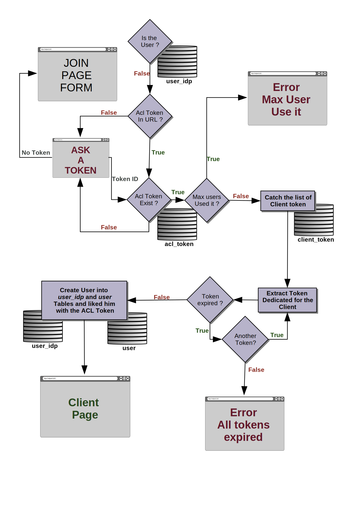

# HOW TO USE THE FIRST AUTHENTICATION

This feature is really usefull when you want to filter the authenticate process. indead, you can control the log part. Each user will need to have some Acl (Access Control List) Token for the first authentication. If no token is found into the URL, a page will ask the user to provide one. If he hasn't, he will have the choice yo be redirect to a join page to fill a form, and then a mail will be send to the system administrator to inform him about the invitation ask. Moreover, if the user provide an existing token, we will check if the token dedicated for the client, where come from the user, is not expired have access. 

## CONFIGURATION FILE

To use properly the first authentication flow, you need to provides a concrete configuration into the configuration file. Like below.
If it is not done, Dex will work like before.

```yaml
firstauth:
  enable: true
  mode: auto
  mailer:
    host: mail.iot.bzh
    port: 587
    user: noreply@redpesk.bzh
    password: XXXxxxxXX
    receiver: awesome.name@iot.bzh
```

| key       | values        | explanation           |
|:----------|:--------------|:----------------------|
| enbale    | auto<br>manual<br>none | mode **auto** will create automatically user after creating a first_auth_token <br> mode **manual** will process the invitation request to allow creation of first_auth_token <br> by **default** it will use automatic mode |
| mailer- host | mail@examle.org | put the SMTP server IP address |
| mailer- port | integer | put the SMTP server port |
| mailer- user | mail@ecapmle.org | put the mail adress to log to the SMTP server |
| mailer- password | xxxxxxxx | put the password to log to the SMTP server |
| mailer- receiver | mail@ecapmle.org | put the mail of the mailer receiver |

## FOUR MORE TABLES

We have created four more tables into the dex.db : 
- **user_idp** :  Will map the id of an user from an idp with an **internal ID** (an unique ID user for the first-aut). It will be usefull to link different accounts (from ldap or from Github, ...)
- **user** : Here we store data informations: with **internalID** an **emai**l, a **pseudo** and some **Acl Tokens**
- **acl_token**: list all acl tokens available with a **description** the maximum of users who can be access to it and a list of **client tokens** linked to it
- - if the maximum users = 1 : means it is a singulare ACL token for just one specific user
- - if the maximum users = 0 : means it is a Global Token, all users can be access to it and this client tokens linked
- **client_token**: list of token for clients with an expiration time. one client_token is for one **clientID** with an **epiration time**, to control the access allow to users by an alToken

##  MANUAL MODE step by step

### First authenticate

We let Dex Oauth flow up to the connector callback and catch the Identity struct and look into the **user_idp** table of dex.db.

### First auth token

If we don't find it, we will look if a token is allocate for the User. We need to have the identification of it. For that 2 possibilities: or it is give into the URL Path *http://.../dex/&Req=xxxxx?AclToken=xxx* or we ask to the User a token thanks to a html page. If the User hasn't a token he will be able to redirect itself to a join page where it will ask him to fill in a form and a mail will be send to the sys-admin. 

Nevertheless, if we got a token ID we check into the **acl_token** table in dex.db if the token exist. Then we check if this token isn't used by the maximum of users, and we list all clientTokens associated. Now we look inforamtion of theses client tokens into the **client_token** table if there is a token giving access to the client and if it hasn't expirated



### First auth user

In this case, we have a valid Token. We create an into **user** table with this Acl token and an **idp_user** to retreive it for the next connection.


## AUTO MODE

In auto mode, when the server will start, a client token will be generated for each static client represented into the config file yaml
And a global acl token will be generated with all of these client token. In this case, when a new user will regiter, he will automaticcaly logged and be linked to the global ACL token.


## DATABASE

[documentation about database](dataBase.md)

## FOR THE NEXT UPDATE

- adding URL with email to trust user's email
- adding html pages to show current clients available with expired delay
- adding algorithm to link idp account