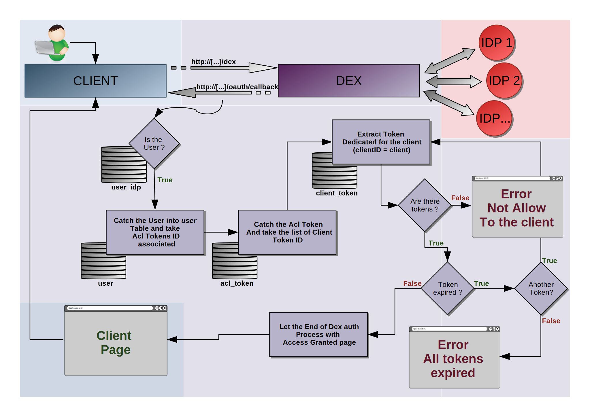

# FIRST AUTHENTICATION

This is a doc to explain modifications applied to execute **first-auth** algorithm

### Intro



### sumary

1. creation of tables
2. manage database
3. creation API on gRPC
4. html templates
5. main algorithm
6. smtp service
7. config file
8. tests

## CREATION OF TABLES

Firstly we need to have two tables to manage our first-auth. 

- Creation of tables into dex/storage/sql/migrate.go we add table into the migration tabs;

```go
		stmts: []string{`
			create table user_idp (
				idp_id text not null primary key,
				intern_id text not null references user(intern_id) ON DELETE CASCADE ON UPDATE CASCADE
			);`,
			`
			create table user (
				intern_id text not null primary key,
				email text,
				pseudo text,
				acl_tokens bytea not null references acl_token(id) ON DELETE CASCADE ON UPDATE CASCADE -- JSON array of strings 
			);`,
			`
			create table acl_token (
				id text not null primary key,
				desc text not null,
				max_user integer,
				client_tokens bytea not null references client_token(id) ON DELETE CASCADE ON UPDATE CASCADE -- JSON array of strings 
			);`,
			`
			create table client_token (
				id text not null primary key,
				client_id text not null,
				created_at timestamptz not null,
				expired_at timestamptz not null
			);`,
		},
```


- Creation of struct to manage table:

```go
// UserIdp map each id from an idp to an internal user
type UserIdp struct {
	IdpID    string `json:"idpid" yaml:"idpid"`
	InternID string `json:"internid" yaml:"internid"`
}

// User represents all users already loggin into Dex
type User struct {
	InternID  string   `json:"internid" yaml:"internid"`
	Pseudo    string   `json:"pseudo" yaml:"pseudo"`
	Email     string   `json:"email" yaml:"email"`
	Username  string   `json:"username" yaml:"username"`
	AclTokens []string `json:"acltokens" yaml:"acltokens"`
}

// AclToken represents Acl Tokens available for users
type AclToken struct {
	ID           string   `json:"id" yaml:"id"`
	Desc         string   `json:"desc" yaml:"desc"`
	MaxUser      string   `json:"maxuser" yaml:"maxuser"`
	ClientTokens []string `json:"clienttokens" yaml:"clienttokens"`
}

// ClientToken represents tokens with expiration for AclToken
type ClientToken struct {
	ID        string    `json:"id" yaml:"id"`
	ClientID  string    `json:"clientid" yaml:"clientid"`
	CreatedAt time.Time `json:"createdat" yaml:"createdat"`
	ExpiredAt time.Time `json:"expiredat" yaml:"expiredat"`
}
```

## MANAGE DATABASES

Now the goal is to create function to be called to manage our two tables. For this we need to plug into some files

|path files|explanation|
|:---------|:----------|
| **./storage/sql/crud.go**         | Write the function body (example: *func (c *conn)CreateFirstAuthToken(){}*) |
| **./storage/storage.go**          | Write the function definition |
| **./storage/static.go**           | Write static function to the Read Only Job |
| **./storage/memory/memory.go**    | add function to the memStorage structure |

Also, we need to do the same modification for each type of databases. For now dex can use SQL, kubernetes and etcd. Just above we explain modification for SQL database type. For the other we need to plug into the following files:

|path files|explanation|
|:---------|:----------|
| **./storage/kubernetes/type.go**      | Add to the global struct the field to our database |
| **./storage/kubernetes/storage.go**   | write function definition and body |
| **./storage/etcd/etcd.go**            | write function definition and body |

### SQL MORE

A work has been done to implement a DELETE / UPDATE CASCADE for sql database:
- if we delete a client token, all reference about this token into acl_token will be delete in updating right aclToken data
- If we delete an acl token, all references to it into  the user table will be also deleting
- if an user into *user* table is deleted. So all user_idp mapped to it will be also deleted

## CREATE API ON gRPC

After that it good to have the possibility to write/read on tables with CLI, to generate Token or change services allow for example. Because Dex already implement gRPC flow for write and read in few tables, we use it for our need.
So We add messages into the proto file to communicate with table. And we write functions into api file.

- **1st step** : add messages and functions prototypes into *./api/api.proto* and *./api/v2/api.proto*
- **2nd step** : Run *make proto* to generate binary for protobuf in *bin/* folder and files *.pb.go
- **3rd step** : write function body into *./server/api.go*

Once done, thanks to Cobra library, we created the gRPC api first-auth binary. The code to the API can be fount into the folder **./cmd/fdirst-auth**. Moreover a documation has been written : **CLI.md** and **gRPCapi.md** 

## HTML Template

We have all tables implemented with all sufficient data for our algorithm. We need now to guide the user with a succession of html file. For that we used the template workaround of Dex

- Into **./server/server.go:l302** we add new path html with handler function

```go
	handleFunc("/firstAuth/join", s.handleFirstAuthJoin)
	handleFunc("/firstAuth/acltoken", s.handleFirstAuthToken)
	handleFunc("/firstAuth/noaccess", s.handleFirstAuthNoAccess)
```

- Into **./server/handlers.go** we write body core of handler function, example:

```go
func (s *Server) handleFirstAuthToken(w http.ResponseWriter, r *http.Request) {
// [...]
	switch r.Method {
	case http.MethodGet:
// [...]
	case http.MethodPost:
// [...]
	}
}
```

-Into **./server/templates.go** we write functions to be able to render html files with wanted data, example:

```go
func (t *templates) firstAuthToken(r *http.Request, w http.ResponseWriter, authReqID, lastToken, token string) error {
	data := struct {
		AuthReqID   string
		Token       string
		TokenPrompt string
		ReqPath     string
	}{authReqID, lastToken, token, r.URL.Path}
	return renderTemplate(w, t.firstAuthTokenTmpl, data)
}
```

To be easier to find changement or merge with previous work, all this modification have been moved into a file: **./server/firstAuth.go**

## main algorithm

See the explanation into the doc: [How use it](HowToUse.md)

## SMTP SERVICE

To allow dex to send mail, we added a SMTP service. It will be used when a user fill-in the invitation request page, to send mail for sys-admin to inform him about the requesting

## Config file

Finnaly, We add a configuration field into the config.yaml file. Indead we allowed or not the first authentification flow, in this case we can continue to use Dex like previously.
Just below an example of a configuration using he first-auth:

```yaml
firstauth:
  enable: true
  mode: auto
  mailer:
    host: mail.iot.bzh
    port: 587
    user: noreply@redpesk.bzh
    password: XXXxxxxXX
    receiver: awesome.name@iot.bzh
```

This configuration is used to enable the first-auth service and give mandatory information about the SMTP service

## test

The last but not least. We have write test about our modification

into **./server/api_test.go** to test API function

TODO: TEst main function first_auth.go