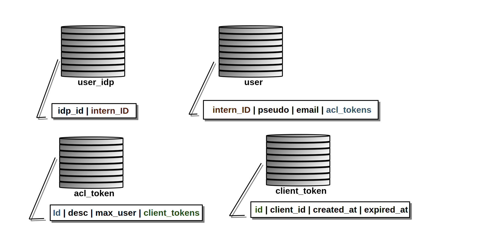

# First authentication database

## FOUR TABLES

To allow the first-authenticate , we need to have 2 tables into dex db. One to manage first authenticate User and another to manage first authenticate token.

## MODIFICATION ON DEX

[documentation about modification](algorithm.md)

## CREATE AN CLI

[documentation about API](CLI.md)
