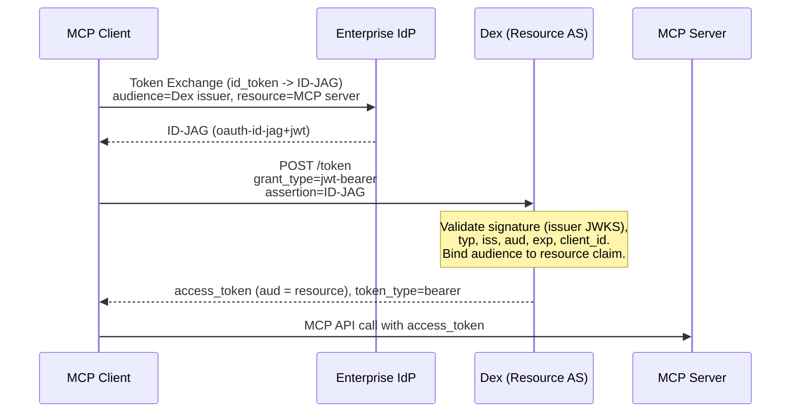

# Dex Enhancement Proposal (DEP) - 2026-06-19 - Enterprise-Managed Authorization for MCP (Resource Authorization Server role)

## Table of Contents

- [Summary](#summary)
- [Context](#context)
- [Motivation](#motivation)
  - [Goals/Pain](#goalspain)
  - [Non-goals](#non-goals)
- [Proposal](#proposal)
  - [User Experience](#user-experience)
  - [Implementation Details/Notes/Constraints](#implementation-detailsnotesconstraints)
  - [Observability](#observability)
  - [Risks and Mitigations](#risks-and-mitigations)
  - [Alternatives](#alternatives)
- [Future Improvements](#future-improvements)

## Summary

The Model Context Protocol (MCP) defines an
[Enterprise-Managed Authorization (EMA)][ema-spec] extension that lets an
organization control MCP server access centrally through its identity provider.
EMA is a profile of the
[Identity Assertion JWT Authorization Grant (ID-JAG)][id-jag] draft: an MCP
client obtains an ID-JAG from the enterprise IdP and redeems it for an access
token at the MCP server's **Resource Authorization Server**.

[DEP 4600][dep4600] adds the IdP side of this exchange — Dex *issuing* ID-JAGs
via Token Exchange. This DEP proposes the complementary **Resource
Authorization Server** role: Dex *accepting* an ID-JAG (minted by a trusted
enterprise IdP) via the JWT Bearer grant ([RFC 7523]) and issuing an access
token that is audience-restricted to the MCP server. Together the two DEPs let
Dex satisfy every server-side role in the EMA flow.

[ema-spec]: https://modelcontextprotocol.io/extensions/auth/enterprise-managed-authorization
[id-jag]: https://datatracker.ietf.org/doc/draft-ietf-oauth-identity-assertion-authz-grant/
[dep4600]: ./id-jag-2026-03-02%234600.md
[RFC 7523]: https://datatracker.ietf.org/doc/html/rfc7523
[RFC 8693]: https://datatracker.ietf.org/doc/html/rfc8693
[RFC 9728]: https://datatracker.ietf.org/doc/html/rfc9728

## Context

- [DEP 4600 - ID-JAG issuance][dep4600] (PR
  [#4611](https://github.com/dexidp/dex/pull/4611)) implements the IdP side:
  Token Exchange with `requested_token_type=urn:ietf:params:oauth:token-type:id-jag`,
  the `oauth-id-jag+jwt` JWT, and static per-client `idJAGPolicies`. **This DEP
  builds directly on it and assumes it has merged.**
- [DEP #2812 - RFC 8693 Token Exchange](https://github.com/dexidp/dex/pull/2812)
  established the Token Exchange foundation.
- The [EMA specification][ema-spec] is *Stable* in the MCP `ext-auth`
  repository and profiles the IETF ID-JAG draft (`-04`).

The roles in the EMA flow, using the spec's terminology:

| EMA role | Who | Dex support |
|---|---|---|
| Client | MCP Client | out of scope (client-side) |
| IdP Authorization Server | enterprise IdP | DEP 4600 (Dex can play it) |
| **Resource Authorization Server** | issues MCP access tokens | **this DEP** |
| Resource Server | MCP Server | out of scope (validates tokens) |

The end-to-end flow (EMA §2), with the part this DEP adds in **bold**:

```
 MCP Client --(SSO / OIDC)-------->  Enterprise IdP   : login -> ID Token
 MCP Client --(RFC 8693 exchange)->  Enterprise IdP   : ID Token -> ID-JAG
 MCP Client --(RFC 7523 jwt-bearer)->Dex (Resource AS): **ID-JAG -> access token**
 MCP Client --(Bearer token)------>  MCP Server       : call MCP API
```

## Motivation

### Goals/Pain

In enterprise MCP deployments, the default per-user/per-server authorization
model creates friction and security gaps: each employee must individually
authorize every MCP server, security teams cannot enforce consistent policy,
and on/offboarding means touching each service. EMA moves the access decision
to the enterprise IdP. For Dex to participate as the authorization server in
front of MCP servers, it must accept the ID-JAG the IdP mints.

Specific goals:

- Accept an ID-JAG presented via the JWT Bearer grant
  (`grant_type=urn:ietf:params:oauth:grant-type:jwt-bearer`, RFC 7523) at the
  existing `/token` endpoint.
- Validate the ID-JAG against a configured set of **trusted issuers**:
  signature against the issuer's JWKS, the `oauth-id-jag+jwt` header type, the
  issuer, the audience (this Dex's issuer per EMA §4), expiry, and an optional
  `client_id` allow-list.
- Issue an access token that is **audience-restricted to the MCP server**
  identified by the ID-JAG `resource` claim (EMA §5.1).
- Advertise support so MCP clients use the brokered flow: add the
  `urn:ietf:params:oauth:grant-profile:id-jag` profile to
  `authorization_grant_profiles_supported` in discovery metadata (EMA §6).
- Be fully opt-in and off by default, with no change to existing deployments.

### Non-goals

- **ID-JAG issuance (the IdP role).** Covered by [DEP 4600][dep4600].
- **SAML assertion → refresh-token exchange** (EMA §4 SAML branch). Only the
  OIDC ID-token path is in scope, consistent with DEP 4600 deferring SAML.
- **A policy / conditional-access engine** (MFA step-up, device posture, group
  evaluation at redemption time). The IdP makes the access decision when it
  mints the ID-JAG; Dex as Resource AS validates that decision and binds the
  audience. Trust configuration is a static allow-list.
- **Client ID Metadata Documents** and `private_key_jwt` client auth (EMA §5).
  Clients authenticate with their registered Dex credentials. CIMD is deferred.
- **RFC 9728 Protected Resource Metadata endpoint.** Useful for client
  discovery of the MCP server → Dex relationship, but orthogonal to the grant
  itself. Listed under Future Improvements.
- **MCP transport concerns** (`initialize` capability negotiation) — entirely
  the MCP client/server layer.

## Proposal

### User Experience

A Dex operator enables the Resource Authorization Server role by configuring a
new `oauth2.enterpriseManagedAuthorization` block and adding the JWT Bearer
grant to `oauth2.grantTypes`. When not configured (the default), the grant is
not registered and behavior is unchanged.

```yaml
oauth2:
  grantTypes:
    # ...existing grants...
    - urn:ietf:params:oauth:grant-type:jwt-bearer   # enables this role
  enterpriseManagedAuthorization:
    enabled: true
    # When true, the verified email from the ID-JAG is carried into the
    # issued access token to support account linking. Default false.
    accountLinkingByEmail: false
    # Enterprise IdPs whose ID-JAGs Dex will accept.
    trustedIssuers:
      - issuer: "https://acme.okta.example"
        jwksURL: "https://acme.okta.example/oauth2/v1/keys"
        # The ID-JAG "aud" must equal this. Defaults to Dex's own issuer.
        expectedAudience: "https://mcp-as.example/"
        # Optional allow-list of accepted ID-JAG "client_id" values.
        allowedClientIDs: ["f53f191f9311af35"]
```

> **Note on `grantTypes`:** Dex computes the supported grant set as the
> intersection of implemented grants with `oauth2.grantTypes` (or its injected
> default when unset). The injected default does not include `jwt-bearer`, so
> operators must list `grantTypes` explicitly to enable this role. Enabling
> `enterpriseManagedAuthorization` alone is not sufficient — this is called out
> in the docs and logged at startup.

The end-to-end exchange, as the MCP client sees it:



The access token request (EMA §5):

```
POST /token HTTP/1.1
Host: mcp-as.example
Authorization: Basic <client credentials>
Content-Type: application/x-www-form-urlencoded

grant_type=urn:ietf:params:oauth:grant-type:jwt-bearer
&assertion=eyJ0eXAiOiJvYXV0aC1pZC1qYWcrand0Ii...
```

The response is a standard OAuth 2.0 token response whose access token is
audience-restricted to the `resource` claim from the ID-JAG:

```
HTTP/1.1 200 OK
Content-Type: application/json
Cache-Control: no-store

{
  "access_token": "eyJhbGciOiJSUzI1NiIs...",
  "token_type": "bearer",
  "expires_in": 86400,
  "scope": "chat.read chat.history"
}
```

Discovery (`/.well-known/openid-configuration`) gains, when enabled:

```json
"authorization_grant_profiles_supported": [
  "urn:ietf:params:oauth:grant-profile:id-jag"
]
```

### Implementation Details/Notes/Constraints

**Grant registration.** A new grant constant and dispatch case are added; the
grant is registered in the supported set only when EMA is enabled:

```go
const grantTypeJWTBearer = "urn:ietf:params:oauth:grant-type:jwt-bearer"

// in newServer, alongside the other allSupportedGrants entries:
if c.EnterpriseManagedAuthorization.Enabled {
    allSupportedGrants[grantTypeJWTBearer] = true
}

// in the /token switch:
case grantTypeJWTBearer:
    s.withClientFromStorage(w, r, s.handleJWTBearerGrant)
```

**Trusted-issuer verifiers.** At startup, one verifier is built per trusted
issuer, backed by a remote JWKS (reusing `go-oidc`'s caching keyset, the same
mechanism the OIDC connector uses). `expectedAudience` defaults to Dex's own
issuer URL:

```go
keySet := oidc.NewRemoteKeySet(ctx, ti.JWKSURL)
verifier := oidc.NewVerifier(ti.Issuer, keySet, &oidc.Config{SkipClientIDCheck: true})
```

**Validation.** `handleJWTBearerGrant` reads the `assertion`, selects the
verifier by the (unverified) `iss`, then fully validates:

```go
// 1. Select verifier by issuer; 2. verify signature/iss/exp via JWKS;
// 3. enforce aud == expectedAudience (EMA §4);
// 4. parse claims; 5. enforce optional client_id allow-list.
idjag, err := s.verifyIDJAG(ctx, assertion)
if err != nil { /* invalid_grant */ }

// EMA §5.1: the access token MUST be audience-restricted to the MCP server.
// Without a resource claim there is no audience to bind, so reject.
if idjag.Resource == "" { /* invalid_grant */ }
```

The `typ: oauth-id-jag+jwt` header is checked, and the consumed claims are
`sub`, `email`, `client_id`, `resource`, and `scope`.

**Resource-bound access token.** The issued token's audience is the `resource`
claim, not the requesting client. This is the one behavioral difference from
the existing token paths, so it lives in a dedicated builder rather than
modifying `getAudience`/`newIDToken`, to guarantee no regression to
authorization-code, refresh, or token-exchange flows:

```go
func (s *Server) newResourceAccessToken(ctx, clientID, resource string, claims storage.Claims) (string, time.Time, error) {
    tok := idTokenClaims{
        Issuer:           s.issuerURL.String(),
        Subject:          claims.UserID,        // the ID-JAG sub
        Audience:         audience{resource},   // EMA §5.1
        AuthorizingParty: clientID,
        // exp/iat/jti...
    }
    // email carried only when accountLinkingByEmail populated it
    return s.signer.Sign(ctx, json.Marshal(tok))
}
```

**Account linking.** The ID-JAG `sub` is treated as opaque. When
`accountLinkingByEmail` is set, the (verified) `email` claim is copied into the
issued token so downstream MCP servers can link to a local account; otherwise
only `sub` is propagated. This composes with [DEP 4600][dep4600], which carries
a verified `email` claim into the ID-JAG it issues.

**Discovery.** `constructDiscovery` appends the id-jag grant profile to a new
`authorization_grant_profiles_supported` field when EMA is enabled. DEP 4600
separately adds `identity_chaining_requested_token_types_supported` for the IdP
role; the two are complementary.

**Files touched** (all additive): a new `server/idjag.go` for the handler,
verifier, and resource-token builder; small additions to `server/oauth2.go`
(constants), `server/server.go` (config + grant registration), `server/handlers.go`
(dispatch + discovery field), and `cmd/dex/config.go` / `cmd/dex/serve.go`
(config plumbing).

### Observability

- Each redemption logs structured fields: requesting `client_id`, ID-JAG
  `iss`/`client_id`, `sub`, `resource`, and granted `scope` on success; the
  precise reason (`untrusted_issuer`, `audience_mismatch`, `missing_resource`,
  signature/expiry failure) on rejection.
- ID-JAG validation failures are returned as `invalid_grant`; a missing
  `assertion` as `invalid_request`; a disabled/unregistered grant as
  `unsupported_grant_type` — matching RFC 6749 §5.2 and RFC 7523.

### Risks and Mitigations

- **Trust misconfiguration is an impersonation risk.** An over-broad
  `trustedIssuers` entry would let that issuer mint tokens for any user. Mitigations:
  default-deny (the role is off unless configured), a required and explicitly
  checked `expectedAudience`, an optional `client_id` allow-list, and logging of
  every accepted/rejected redemption with `iss`/`client_id`/`resource`.
- **Replay.** A stolen ID-JAG is replayable within its lifetime. Mitigated by
  relying on the IdP's short ID-JAG expiry (validated here) and the audience
  restriction. Server-side `jti` caching is deferred (see DEP 4600, same stance).
- **Audience-binding regressions.** The `resource`→`aud` behavior is isolated in
  a dedicated token builder and covered by tests asserting that
  authorization-code/refresh/token-exchange audiences are unchanged.
- **Spec maturity.** EMA is *Stable* in MCP but profiles an IETF *draft* (`-04`);
  claim/field names may still shift. The entire feature is behind opt-in config,
  so churn is contained.
- **Breaking changes: none.** Purely additive. With no `enterpriseManagedAuthorization`
  config, the grant is not registered, discovery is unchanged, and the new code
  paths are unreachable.

### Alternatives

- **External-IdP-only (no Dex IdP role).** Pairs naturally with DEP 4600: this
  DEP works with any conformant ID-JAG issuer (e.g. Okta Cross-App Access), and
  also composes with a second Dex running DEP 4600 — enabling a fully
  self-contained, testable deployment without a third-party IdP.
- **Fold audience binding into the existing token builders** (`getAudience`).
  Rejected: it would entangle a security-sensitive change with every other grant
  and risk silent regressions; a dedicated builder is safer and clearer.
- **CEL/OPA policy at redemption time.** Unnecessary: the access decision is made
  by the IdP when it issues the ID-JAG. Dex's job here is validation and audience
  binding, not re-deciding policy.
- **Do nothing.** Dex can issue ID-JAGs (DEP 4600) but cannot sit in front of MCP
  servers in an EMA deployment, leaving the server-side story half-complete.

## Future Improvements

- **RFC 9728 Protected Resource Metadata** endpoint
  (`/.well-known/oauth-protected-resource`) so MCP clients can discover the
  MCP-server → Dex relationship and the resource identifier.
- **RFC 8707 `resource` parameter** plumbing for non-EMA flows, enabling
  resource-bound tokens generally.
- **Server-side `jti` tracking** to prevent ID-JAG replay within the validity
  window (shared with DEP 4600).
- **Trusted-issuer config via storage/CEL** so issuers can be managed without a
  restart, building on the CEL infrastructure referenced by DEP 4600.
- **SAML 2.0 assertion path** for IdPs that use SAML for SSO (EMA §4 SAML branch).
