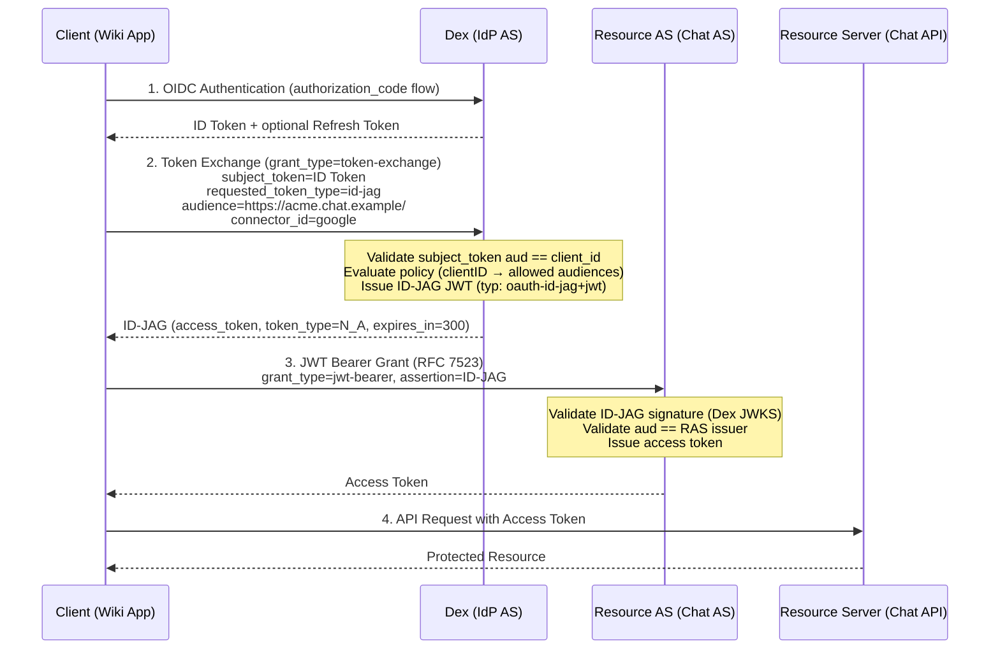

# Dex Enhancement Proposal (DEP) 4600 - 2026-03-02 - Identity Assertion JWT Authorization Grant (ID-JAG)

## Table of Contents

- [Dex Enhancement Proposal (DEP) 4600 - 2026-03-02 - Identity Assertion JWT Authorization Grant (ID-JAG)](#dex-enhancement-proposal-dep-4600---2026-03-02---identity-assertion-jwt-authorization-grant-id-jag)
  - [Table of Contents](#table-of-contents)
  - [Summary](#summary)
  - [Context](#context)
  - [Motivation](#motivation)
    - [Goals/Pain](#goalspain)
    - [Non-goals](#non-goals)
  - [Proposal](#proposal)
    - [User Experience](#user-experience)
    - [Implementation Details/Notes/Constraints](#implementation-detailsnotesconstraints)
    - [Observability](#observability)
    - [Risks and Mitigations](#risks-and-mitigations)
    - [Alternatives](#alternatives)
  - [Future Improvements](#future-improvements)

## Summary

[draft-ietf-oauth-identity-assertion-authz-grant-02] specifies a mechanism
for an application to use an identity assertion to obtain an access token
for a third-party API by coordinating through a common enterprise identity
provider using Token Exchange [RFC 8693] and JWT Profile for OAuth 2.0
Authorization Grants [RFC 7523].

This DEP proposes to extend Dex's existing Token Exchange implementation
to support issuing Identity Assertion JWT Authorization Grants (ID-JAGs),
enabling cross-domain access managed by the enterprise IdP.

[draft-ietf-oauth-identity-assertion-authz-grant-02]: https://datatracker.ietf.org/doc/draft-ietf-oauth-identity-assertion-authz-grant/

## Context

- [#2812 DEP for RFC 8693 OAuth 2 Token Exchange]
  established the Token Exchange foundation that ID-JAG builds upon.
- [draft-ietf-oauth-identity-assertion-authz-grant-02]
  is the IETF Standards Track specification this DEP implements.
- [draft-ietf-oauth-identity-chaining]
  is the broader identity chaining specification that ID-JAG profiles.

The specification is authored by A. Parecki (Okta), K. McGuinness, and
B. Campbell (Ping Identity). It is actively being developed within the
IETF OAuth Working Group.

Use cases:

- LLM agents accessing enterprise APIs on behalf of users (Appendix A.3 of the spec)
- Enterprise applications embedding content from third-party apps
- Email/calendaring applications accessing cross-domain resources

Real-world adoption:

- [Okta Cross App Access] is GA, implementing ID-JAG for SaaS-to-SaaS and
  AI agent scenarios with a developer tutorial available.
- [Okta AI Agent Token Exchange] (Early Access) uses ID-JAG for AI agents
  accessing enterprise APIs on behalf of authenticated users.
- [Keycloak #43971] tracks ID-JAG support as a feature request.
- The upcoming MCP (Model Context Protocol) specification references ID-JAG
  for AI agent authorization flows.

[#2812 DEP for RFC 8693 OAuth 2 Token Exchange]: https://github.com/dexidp/dex/pull/2812
[draft-ietf-oauth-identity-chaining]: https://datatracker.ietf.org/doc/draft-ietf-oauth-identity-chaining/
[Okta Cross App Access]: https://developer.okta.com/blog/2026/02/10/xaa-client
[Okta AI Agent Token Exchange]: https://developer.okta.com/docs/guides/ai-agent-token-exchange/authserver/main/
[Keycloak #43971]: https://github.com/keycloak/keycloak/issues/43971

## Motivation

### Goals/Pain

In enterprise environments, applications are configured for SSO through
a common IdP. When one application needs to access a user's data at another
application, the current approach requires either:

1. A direct OAuth flow between apps (bypassing the IdP's visibility and policy)
2. Static API keys or service accounts (security risk)

ID-JAG solves this by letting the IdP broker cross-domain access, maintaining
visibility and policy control.

**Specific goals:**

- Issue ID-JAG tokens via Token Exchange (`requested_token_type=urn:ietf:params:oauth:token-type:id-jag`)
- Support `audience` and `resource` parameters per the specification
- Validate subject token audience against requesting client
- Support configurable policy evaluation for token exchange requests

### Non-goals

- Implementing the Resource Authorization Server role (JWT Bearer Grant / RFC 7523)
  is out of scope for this initial DEP. It may be addressed in a follow-up.
- SAML assertion support as `subject_token_type` is deferred.
- Step-up authentication flow is deferred.

## Proposal

### User Experience

End-to-end flow:



Clients can request ID-JAG tokens from Dex's `/token` endpoint by specifying
`requested_token_type=urn:ietf:params:oauth:token-type:id-jag` in a
Token Exchange request. ID-JAG support is enabled by adding
`urn:ietf:params:oauth:token-type:id-jag` to `oauth2.tokenExchange.tokenTypes`.
When not listed, requests with this `requested_token_type` are rejected,
ensuring no change in behavior for existing deployments.

The request parameters (extending existing Token Exchange):

- `grant_type`: REQUIRED - `urn:ietf:params:oauth:grant-type:token-exchange`
- `subject_token`: REQUIRED - the identity assertion (OpenID Connect ID Token)
- `subject_token_type`: REQUIRED - `urn:ietf:params:oauth:token-type:id_token`.
  SAML 2.0 (`urn:ietf:params:oauth:token-type:saml2`) is deferred (see Non-goals).
- `requested_token_type`: REQUIRED - `urn:ietf:params:oauth:token-type:id-jag`
- `audience`: REQUIRED - the Issuer URL of the Resource Authorization Server.
  **Note**: The existing Token Exchange implementation uses a Dex-specific `connector_id`
  parameter (not part of RFC 8693) for connector selection. The `audience` parameter was
  not used in the current implementation despite DEP #2812 originally proposing it for
  connector identification. ID-JAG introduces `audience` with its standard RFC 8693
  meaning (target Resource AS). This is purely additive and does not affect existing
  Token Exchange requests.
- `connector_id`: REQUIRED (Dex extension) - the ID of the Dex connector to verify the
  subject token against. The connector validates the token (issuer, signature, etc.),
  so a mismatched token is rejected. This parameter already exists in the current
  Token Exchange implementation and is reused as-is.
- `resource`: OPTIONAL - the Resource Identifier of the Resource Server
- `scope`: OPTIONAL - the requested scopes at the Resource Server

The response:

- `access_token`: the ID-JAG JWT (named `access_token` for RFC 8693 compatibility)
- `issued_token_type`: `urn:ietf:params:oauth:token-type:id-jag`
- `token_type`: `N_A` (this is not an OAuth access token)
- `expires_in`: lifetime in seconds (default: 300, configurable independently of ID token
  lifetime via `expiry.idJAGTokens`)
- `scope`: OPTIONAL if the issued scope is identical to the requested scope; REQUIRED
  otherwise. Per Section 4.3.2 of the specification, policy evaluation at the IdP may
  result in different scopes being issued than were requested.

Complete configuration example:

```yaml
oauth2:
  grantTypes:
    - authorization_code
    - urn:ietf:params:oauth:grant-type:token-exchange
  tokenExchange:
    # List of token types enabled for exchange. Adding id-jag enables ID-JAG support.
    # Omitting it (default) disables ID-JAG without affecting other token exchange flows.
    # SAML2 (urn:ietf:params:oauth:token-type:saml2) may be added in a future release.
    tokenTypes:
      - urn:ietf:params:oauth:token-type:id_token
      - urn:ietf:params:oauth:token-type:id-jag

expiry:
  idTokens: "24h"
  idJAGTokens: "5m"  # default: 5m; independent of idTokens

staticClients:
  - id: wiki-app
    name: "Wiki Application"
    secret: "wiki-secret"
    redirectURIs:
      - "https://wiki.example/callback"
    # Per-client ID-JAG policy. Clients without this section cannot obtain ID-JAG tokens
    # (default-deny). Only audiences and scopes listed here may be requested.
    idJAGPolicies:
      allowedAudiences:
        - "https://chat.example/"
        - "https://calendar.example/"
      allowedScopes:
        - "chat.read"
        - "calendar.read"

  - id: supermarket-app
    name: "Supermarket Application"
    secret: "supermarket-secret"
    redirectURIs:
      - "https://supermarket.example/callback"
    idJAGPolicies:
      allowedAudiences:
        - "https://grocery.store.1/"
        - "https://grocery.store.2/"
      allowedScopes:
        - "eat.bananas"
        - "eat.apples"
```

### Implementation Details/Notes/Constraints

- A new `id-jag` branch is added to the existing Token Exchange flow, issuing a signed JWT
  per Section 3 of the specification (header `typ: "oauth-id-jag+jwt"`, claims including
  `iss`, `sub`, `aud`, `client_id`, `jti`, `exp`, `iat`).

- Per-client `idJAGPolicies` in `staticClients` control which audiences and scopes a
  given client may request in an ID-JAG. Clients without `idJAGPolicies` are denied
  by default. Dynamically registered clients are currently unsupported for ID-JAG policies;
  support via CEL expressions (building on the CEL infrastructure from #4601) is future work.

- OIDC discovery is extended with `identity_chaining_requested_token_types_supported` per
  Section 7 of the specification. When ID-JAG is enabled, Dex includes
  `urn:ietf:params:oauth:token-type:id-jag` in this metadata property.

- ID-JAG support is enabled by listing `urn:ietf:params:oauth:token-type:id-jag` in
  `oauth2.tokenExchange.tokenTypes`. When not listed (default), requests are rejected,
  ensuring no change in behavior for existing deployments.

### Observability

- Every ID-JAG token exchange request (issued or rejected) emits a structured log entry
  with `client_id`, `connector_id`, `audience`, `resource` (if present), requested and
  granted `scope` (these may differ after policy evaluation), `sub`, `jti` (if issued),
  and the policy decision (`approved`/`denied` with reason like `audience_not_allowed`
  or `client_has_no_policy`).

- The following Prometheus counters are exposed:
  - `dex_id_jag_requests_total` (labels: `result`) — issued vs rejected
  - `dex_id_jag_policy_rejections_total` (labels: `reason`) —
    breakdown by denial reason, useful for spotting misconfigurations or abuse
  - `dex_id_jag_scope_modifications_total` — cases where policy reduced the requested scopes

### Risks and Mitigations

- **Lateral movement risk**: Same as existing Token Exchange. Mitigated by
  not issuing refresh tokens, short expiry (5 min recommended), and
  policy-based audience restrictions.
- **Token confusion**: The `typ: "oauth-id-jag+jwt"` header and distinct
  `issued_token_type` prevent confusion with ID Tokens or access tokens.
- **Replay attack risk**: Server-side `jti` tracking is deferred, so a stolen ID-JAG
  can be replayed within its 5-minute lifetime. Short `expires_in` is the only Dex-side
  mitigation; Resource Authorization Servers should implement `jti` caching independently.
- **Public client misuse**: Per Section 8.1 of the specification, ID-JAG SHOULD only be
  used by confidential clients. Public clients should use the standard authorization code
  flow with interactive user consent at the Resource Authorization Server. Dex will enforce
  this by rejecting ID-JAG requests from public clients (clients without a secret).
- **Breaking changes**: None. This is purely additive to the existing
  Token Exchange implementation. The `audience` parameter is newly introduced
  (not previously used in the implementation despite DEP #2812's original proposal),
  and `connector_id` already exists.

### Alternatives

- **Wait for spec finalization**: The draft is Standards Track and stable enough
  to implement. Okta and Ping Identity (the spec authors) already ship implementations,
  and the spec has been adopted by the IETF OAuth WG.
- **External policy engine (OPA/CEL)**: Config-based policies are sufficient for now.
  The CEL infrastructure (#4601) is merged; ID-JAG policy evaluation via CEL is future work.

## Future Improvements

- Resource Authorization Server role (JWT Bearer Grant / RFC 7523)
  accepting ID-JAGs from external IdPs
- SAML 2.0 assertion support as `subject_token_type`
  (`urn:ietf:params:oauth:token-type:saml2`)
- CEL-based ID-JAG policy evaluation (building on #4601) enabling dynamic policies for
  DB-managed clients, including runtime policy changes without restart
- Step-up authentication when authentication context is insufficient
- `actor_token` support for delegation scenarios
- Server-side `jti` tracking to prevent ID-JAG replay attacks
