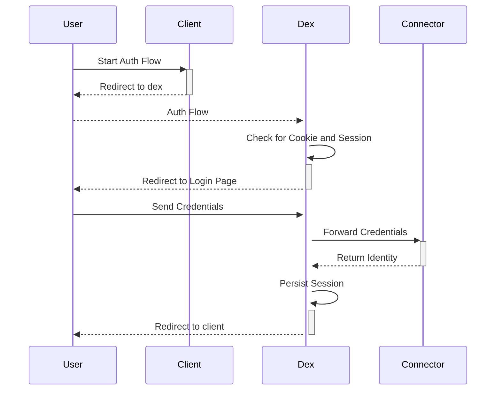
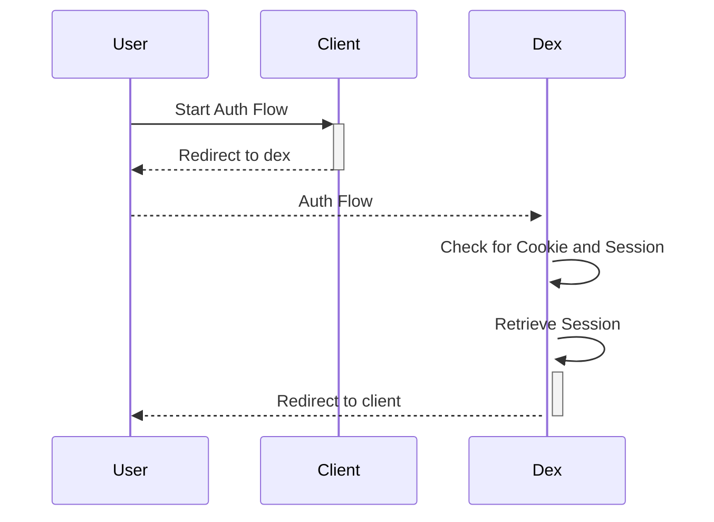

# Dex Enhancement Proposal (DEP) <#32> - <2025-10-19> - Remembe Me

## Table of Contents

- [Summary](#summary)
- [Motivation](#motivation)
    - [Goals/Pain](#goals)
    - [Non-Goals](#non-goals)
- [Proposal](#proposal)
    - [User Experience](#user-experience)
    - [Implementation Details/Notes/Constraints](#implementation-detailsnotesconstraints)
    - [Risks and Mitigations](#risks-and-mitigations)
    - [Alternatives](#alternatives)
- [Future Improvements](#future-improvements)

## Summary

Avoid repeated re-authentications when using password-based (sessionless) connectors by
storing a server-side (dex) session of the user login and re-use it instead.

## Context

https://github.com/dexidp/dex/issues/32

## Motivation

### Goals/Pain

- Minimal viable implementation of remember me functionality scoped to only password-based connectors
- If the same user is authenticating through dex using n>1 applications (clients) during a session (predefined timeframe), the user should not be prompted to log in again
- Avoid bad UX where each application (client) triggers a new login with the password connector
- Implement for the in-memory storage backend

### Non-goals

- Implement for any other storage backend
- Implement for any non-password connector

## Proposal

### User Experience

- When the user logs in once using the password-based connector he is never prompted to login again until his session expires
- Once a session has been obtained the authflow is frictionless and mostly automatic

### Implementation Details/Notes/Constraints

- Implementation is in a separate package to separate concerns and keep code isolated
- Add new specific interface for storage to avoid bloating the already huge storage (`storage.Storage`) interface
- Each connector has a specific cookie to allow having more than one password-based connector (also for security purposes)
- Cookies are signed just as JWT are and verified each time to ensure authenticity

Regular password-based connector flow but with active sessions (no session found case).

Improved UX flow with active session (session found).

### Risks and Mitigations

- I am not absolutely sure whether this introduces any attack vectors that could be exploited.
- This DEP does not introduce any breaking changes.

### Alternatives

- None. We can declare this out of scope, but other than developing.

## Future Improvements

- None
