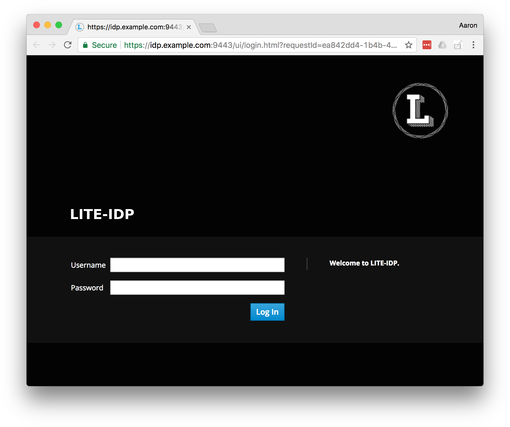

= LITE-IDP

LITE-IDP is a lightweight SAML 2.0 Identity Provider and Service Provider library written in Go. The project's goal is to create an IdP that is easier to configure and extend than https://www.shibboleth.net/[Shibboleth's IdP].

== Status

The initial implemention of SAML 2 protocols was completed in 2015. However, the project lacked an extensible configuration mechanism. It was converted to use https://github.com/spf13/cobra[Cobra] and https://github.com/spf13/viper[Viper] in September 2017 and is now easy to use customize.

=== Identity Provider

The identity provider has the following features.

* HTTP Redirect Binding
* HTTP POST Binding - responses only not for requests
* HTTP Artifact Binding
* SAML Metadata Generation
* X.509 Certificate Authentication
* Username/Password Authentication

It has been successfully tested with the Shibboleth Service Provider.

=== Service Provider

The service provider library makes it easy to integrate Go applications with SAML identity providers. It supports the following features.

* HTTP Redirect Binding
* HTTP Artifact Binding
* SAML Metadata Generation

The SP will likely never support the HTTP POST binding. I created a XML Digital signature library https://github.com/amdonov/xmlsig[xmlsig] that is capable of signing XML. However, verifying XML signatures is far more challenging, and introduction of C libraries is not desirable. Transport level security can be used with Artifact Binding, but message level verification is required because the SAML assertion is passed from the IdP to SP via the user.

Honestly, I prefer the Artifact Binding as it is very much like an OAuth 2 server side flow.

The SP has been successfully tested with the Shibboleth Identity Provider.

== Getting Started

To minimize external dependencies, the default build uses a single file to configure application properties and hold user information.

.Build the binary
----
go get github.com/amdonov/lite-idp/lite-idp
----

.Sample Configuration file
----
tls-ca: hack/tls-setup/certs/ca.pem
tls-private-key: hack/tls-setup/certs/idp-key.pem
tls-certificate: hack/tls-setup/certs/idp.pem

users:
 - name: CN=John Doe, OU=lite-idp sample, O=autogenerated, L=the internet # <1>
   attributes:
     SurName: 
      - Doe
     FirstName: 
      - John
     FullName: 
      - John Doe
 - name: amdonov
   password: '$2a$10$U41uarKrlduOofvJRC724.7V7RRZOciyC4TZ4UAQUtWuPuKVvByR.' # <2>
   attributes:
     SurName: 
      - Donovan
     FirstName: 
      - Aaron
     FullName: 
      - Aaron Donovan
----
<1> User that will authentication with client certificate. 
<2> User that will authenticate with password. Passwords can be hashed with the commmand *lite-idp hash*  

You can use existing certificates or use the Makefile in hack/tls-setup to generate some. 

NOTE: ECDSA certificates cannot currently be used for signing.

.Running
----
lite-idp --config lite-idp.yaml
----

By default lite-idp will look for the configuration file at /etc/lite-idp/lite-idp.yaml. In addition to the configuration file many options can be provided on the command line or via environment variables.

== Customizing

All aspects of the IdP's behavior are customizable. It's controlled through an open struct and viper configuration values. Reasonable defaults make it easy to get running quickly and tailor it over time. The default behavior is shown it the following code.

.Section of lite-idp/cmd/root.go
----
import "github.com/amdonov/lite-idp/idp"
...
		idp := &idp.IDP{} // <1>
		handler, err := idp.Handler()
		if err != nil {
			return err
		}
		server := &http.Server{
			TLSConfig: idp.TLSConfig,
			Handler:   handlers.CombinedLoggingHandler(os.Stdout, hsts(handler)),
			Addr:      viper.GetString("listen-address"),
		}
----
<1> Default IDP struct without configuration

One can examine the struct to see interation points. Some key ones are highlighted below.

=== Password Validation

Many organizations still use username/password for authentication. Validation of user provided passwords is controlled by the IDP's PasswordValidator. If one isn't provided it will use a simple one that reads hashed passwords from the configuration file. Developers can use that implemation as example. Viper makes it easy retrieve any required custom parameters from the configuration file.

.PasswordValidator interface
----
type PasswordValidator interface {
	Validate(user, password string) error
}
----

=== User Attributes

The IdP enables retrieval of user attributes from multiple sources through the AttributeSource interface. The IdP will read attributes from the configuration file if no AttributeSources are provided.

.AttributeSource interface
----
type AttributeSource interface {
	AddAttributes(*model.User) error
}
----

=== Login Page

The default login page was created using http://www.patternfly.org/[Patternfly's] login template. The hack/ui folder contains a small npm project that packages the HTML, JavaScript, and assets for bundling and inclusion in a go source file with https://github.com/elazarl/go-bindata-assetfs[go-bindata-assetfs].

=== Storing State

The IdP needs to store some state both short term (minutes) and longer term (hours). For example, keeping request information while a user enters data in a login form or maintaing active sessions to enable single-sign on. Both cases are handled through a common interface.

.Cache interface
----
type Cache interface {
	Set(key string, entry []byte) error
	Get(key string) ([]byte, error)
	Delete(key string) error
}
----

Data is marshalled to a byte slice using protocol buffers to save space and increase performance. The default implementation uses https://github.com/allegro/bigcache[BigCache]. It's trival to replace this implementation with something like Redis or memcached if desired. The relevant IDP fields are TempCache and UserCache.

== Clustered Deployments

It's possible to scale the IdP horizontally and use centralized state and configuration. Viper supports retrieval of configuration information from etcd, and as discussed in Storing State, the IdP can store all state information in external systems.